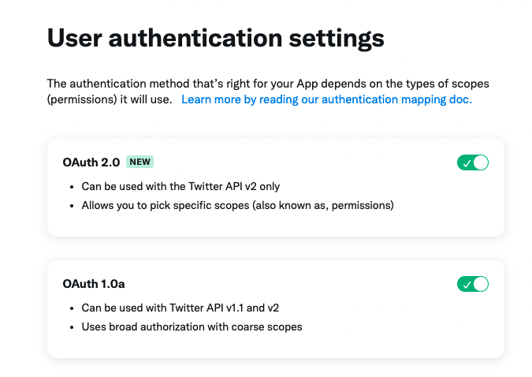
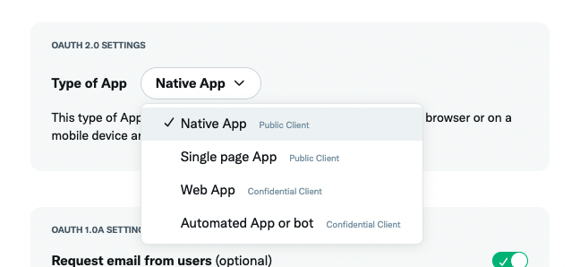

# How do I authenticate?

There are multiple and complex ways to authenticate to Twitter. You will also need to configure your settings in the Developer Portal.

This document describes how to set up the Developer Portal and authenticate using TwitterAPIKit.

## Type of authentication method

- OAuth 1.0a (3-legged OAuth flow)
  - PIN based
- OAuth 2.0 Authorization Code Flow with PKCE
- OAuth 2.0 Bearer Token (app-only)

## OAuth 1.0a (3-legged OAuth flow)

### Preparations

Turn on the OAuth 1.0a switch.

<div style="text-align: center;">
    
</div>

### Auth

> https://developer.twitter.com/en/docs/authentication/oauth-1-0a/obtaining-user-access-tokens

See the code in the sample project.

> https://github.com/mironal/TwitterAPIKit-iOS-sample/blob/main/TwitterAPIKit-iOS-sample/OAuth/OAuth1ThreeLeggedOAuthFlowViewController.swift

### PIN based

> https://developer.twitter.com/en/docs/authentication/oauth-1-0a/pin-based-oauth

```swift
// for CLI tool
func runOAuth() {
    client.auth.postOAuthRequestToken(.init(oauthCallback: "oob")).responseObject(queue: .main) { response in
        do {
            let success = try response.result.get()
            print("Token:", success)

            let url = client.auth.makeOAuthAuthorizeURL(.init(oauthToken: success.oauthToken, forceLogin: true))!
            print("Enter this URL into your browser and enter the PIN code that will be displayed after authentication.")
            print(url)

            let pinCode = readLine()!

            client.auth.postOAuthAccessToken(.init(oauthToken: success.oauthToken, oauthVerifier: pinCode))
                responseObject(queue: .main) { response in
                do {
                    let success = try response.result.get()
                    print("AccessToken:", success)

                } catch let error {
                    print("Error")
                    print(error)
                }
            }
        } catch let error {
            print("Error")
            print(error)
        }
    }
}

// Output of runOAuth

/*
 Token: TwitterOAuthTokenV1(oauthToken: "your-token", oauthTokenSecret: "your-secret", oauthCallbackConfirmed: Optional(true))
 Enter this URL into your browser and enter the PIN code that will be displayed after authentication.
 https://api.twitter.com/oauth/authorize?force_login=true&oauth_token=your-token
 > your pin
 AccessToken: TwitterOAuthAccessTokenV1(oauthToken: "", oauthTokenSecret: "", userID: Optional(""), screenName: Optional(""))
*/
```

## OAuth 2.0 Authorization Code Flow with PKCE

### Preparations

Turn on the OAuth 2.0 switch.

<div style="text-align: center;">
    
</div>

OAuth 2.0 Authorization Code Flow with PKCE has two authentication methods: Public Client and Confidential Client.

Please check which authentication method you have selected.

Most iOS applications are Public Client (Native App).

<div style="text-align: center;">
    
</div>

### Auth

> https://developer.twitter.com/en/docs/authentication/oauth-2-0/authorization-code

See the code in the sample project.

> https://github.com/mironal/TwitterAPIKit-iOS-sample/blob/main/TwitterAPIKit-iOS-sample/OAuth/OAuth2CodeFlowPKCEViewController.swift

## OAuth 2.0 Bearer Token (app-only)

> https://developer.twitter.com/en/docs/authentication/oauth-2-0/application-only

```swift

var client: TwitterAPIClient!

func runAuth() {
    client = TwitterAPIClient(
        .basic(apiKey: "your consumer key", apiSecretKey: "your consumer secret")
    )

    client.auth.postOAuth2BearerToken(.init()).responseObject(queue: .main) { response in
        do {
            let success = try response.result.get()
            print("Token:", success)
        } catch let error {
            print("Error")
            print(error)
        }
    }
}

func useBearerToken() {
    let client = TwitterAPIClient(.bearer("<token>"))
    client.v1.getUserTimeline(.init(target: .screenName("twitterapi"))).responseData { response in
        print(response.prettyString)
    }
}
```
